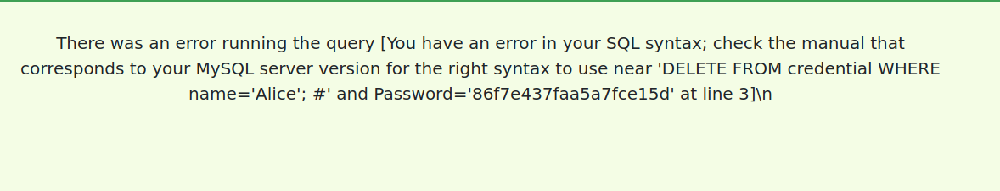

# Trabalho realizado na Semana #8 e #9

## Tarefa 1.1

Para obter os dados de Alice, foi usado o seguinte comando de SQL:

```sql
select * from credential where Name='Alice';
```


## Tarefa 2.1

O objetivo desta tarefa é fazer um ataque a uma web app que se encontra em www.seed-server.com através de SQL Injection. Ao entrar neste site deparamo-nos com um campo de input de username e de password. O objetivo é realizar o login com a conta de admin, da qual não se conhece a password. O campo password é protegido por hashing o que indica que a injeção deverá ser feita com no campo username. Dois inputs diferentes foram testados que resultaram no sucesso do login na conta de admin:

- admin'; #
- admin' or ''='

O primeiro faz uso de comentários para que a validação da password não seja feita e o segundo usa uma injeção de um or que faz com que a comparação dê sempre verdadeiro.


Após o login como admin ser realizado com sucesso o que obtemos é uma tabela com informações sobre os utilizadores.


## Tarefa 2.2

O objetivo continua a ser ganhar acesso da conta de admin mas desta vez através da consola e não da webpage.

Para tal foi usado o comando:
```sh
$ curl 'http://www.seed-server.com/unsafe_home.php?username=admin%27%3B+%23&Password=a' > test.html
```

Ao abrir test.html, ficheiro para o qual foi passado o resultado do curl, obtem-se o seguinte.


## Tarefa 2.3

O objetivo era verificar que existe uma defesa que impede que uma query nova seja injetada através dos mesmos campos usados anteriormente. Para verificar tal foi usado o seguinte input:

```
admin'; DELETE FROM credential WHERE name='Alice'; #
```

Que tinha como objetivo apagar da tabela de credenciais a informação da Alice, no entanto tal não foi possível e o resultado foi o seguinte:



Não é possível injetar mais *SQL statements* graça à proteção conseguida através uso da extensão *mysqli* para *PHP*. *mysqli* oferece tanto *query()* como *multi_query()*, o primeiro por motivos de segurança apenas permite que a primeira query seja executada, já o segundo permite a execução de várias queries e é portanto menos seguro.


## Tarefa 3.1

Primeiro é necessário fazer login na conta da alice, tal foi conseguido com o seguinte input de username e uma password arbitrária.

```
alice' #
```


Podemos agora editar o perfil da Alice. Fez-se uso do campo nickname para realizar o ataque, sendo este o input.

```
', salary=80000, nickname='
```

Ficando o perfil da Alice com os seguintes valores.


## Tarefa 3.2

Agora para alterar o salario temos  de 'alterar' o campo WHERE a query de SQL, sendo o input:

```
', salary=1 WHERE name='Boby'; #
```

Podemos confirmar que o salário de Boby foi efetivamente atualizado:


## Tarefa 3.3

Para conseguirmos mudar a password de outra pessoa vamos ter de usar dois campos diferentes.
Tal é necessário porque o ataque não pode ser feito diretamente no campo password pois o código faz hash desta password e guarda então esta hash.

Foi utilizado o campo *Phone Number* pois este é o único que aparece após o campo password na query de SQL em PHP.

```php
$hashed_pwd = sha1($input_pwd);
$sql = "UPDATE credential SET
    nickname=’$input_nickname’,
    email=’$input_email’,
    address=’$input_address’,
    Password=’$hashed_pwd’,
    PhoneNumber=’$input_phonenumber’
    WHERE ID=$id;";
$conn->query($sql);
```

A password foi mudada para 'alicerocks' e o input do *Phone Number* foi:
```
' WHERE name='Boby'; #
```

Agora é então possível fazer login na conta de Boby com a nova password.


# CTF #8 e #9

## Desafio 1

No acesso à página web fornecida para o desafio é apresentado um formulário de login e um link para logout. Fica claro que a primeira abordagem para procurar e explorar uma vulnerabilidade será no formulário.

Ao analisar o código fonte é possível notar que não há sanitização entre o input do formulário e query de sql que verifica o login. Isto é a vulnerabilidade que será explorada e usada para um ataque.

Esta vulnerabilidade permite então um ataque recorrendo a SQL injection:


Este método é muito semelhante ao que foi usado na tarefa 2.1, sendo a unica diferença a sintaxe de SQL usada.


Conseguimos assim aceder ao cofre e obter a flag

```
flag{3970fbb4af4d7e800b6104bb768fd072}
```

## Desafio 2

As funcionalidades disponíveis ao utilizador sem estar autenticado são a de fazer login através de um formulário, obter um speed report da nossa rede atual e a possibilidade de fazer ping a um host

O formulário aparenta estar protegido e não parece ser provável que este revele uma vulnerabilidade que possa ser explorada.

O speed report também não parece ser promissor visto que o único input que recebe do utilizador é um click num botão. Resta então o ping a um host.

Seguindo a dica dada no enunciado deste desafio, será prudente apostar que o servidor esteja a fazer algo parecido com uma system call ou mesmo que os inputs sejam passados a, por exemplo, uma bash de linux.

Primeiro irá ser usado o seguinte input de modo a termos método de comparação.

```
127.0.0.1
```

Este foi o resultado:


E agora com :

```
127.0.0.1; whoami
```

O resultado que é esperado é que seja possível fazer ping ao localhost (127.0.0.1) e também obter o user name associado ao uid associado ao processo encarregue de lidar com estes inputs.


Conclui-se que é possível fazer a injeção de comandos de consola.

Agora para tentar capturar a flag sabemos que precisamos chegar ao ficheiro flag.txt. O comando *cat* cancatena ficheiros e imprime-os no *stdout*.

```
127.0.0.1; cat /flag.txt
```


Conseguimos então chegar à flag:

```
flag{3e0d6f00000e611a9c15aeb018dad2d4}
```
